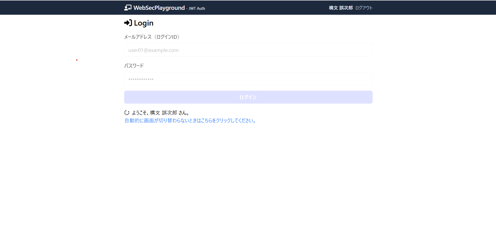
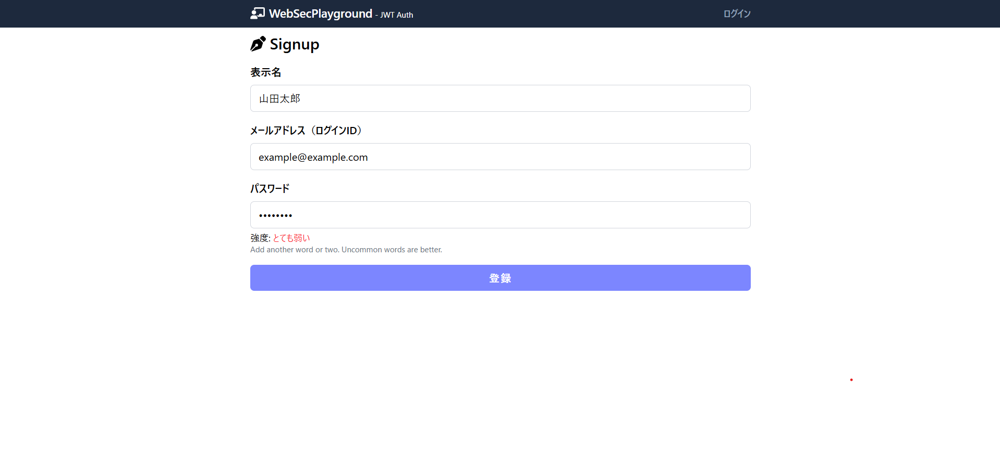
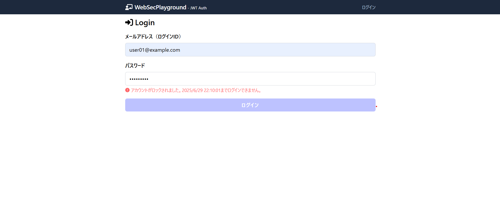

# Web Sec Playground

## 概要
このプロジェクトは、Next.js + Prisma + SQLite を用いたシンプルなユーザ認証アプリです。

- ユーザ登録（サインアップ）・ログイン機能

- パスワードはbcryptで安全にハッシュ化
- サインアップ時にパスワード強度をリアルタイム表示

- 連続5回ログイン失敗でアカウントロック（30分）


## 主な機能
- サインアップ時、パスワード強度をzxcvbnで判定しUI表示
- ログイン失敗5回でアカウントロック（30分後に自動解除）
- パスワードは常にハッシュ化して保存

## 注意
- 認証方式はJWTまたはセッションのどちらか一方のみ有効です（`src/config/auth.ts`で切替）

---

## 開発・カスタマイズ
- Prismaスキーマは`prisma/schema.prisma`を編集し、`npx prisma db push`で反映
- シードデータは`prisma/seed.ts`を編集
- 認証ロジックは`src/app/api/login/route.ts`や`src/app/_actions/signup.ts`を参照

---

MIT License

## ⚠️ 重要な注意事項

このプロジェクトは **ウェブアプリのセキュリティ実験用のコンテンツ** です。学習と検証を目的として、あえて脆弱性を含む設計となっています。

- このウェブアプリを公開サーバーやインターネット上でホストしないでください。
- 自分以外がアクセス可能な環境にデプロイしないでください。
- ローカル環境（localhost）でのみ実行してください。

このコードには意図的に組み込まれたセキュリティの脆弱性💀があります。セキュティ学習用の教材としてのみ利用してください。

## セットアップ手順

### 1. リポジトリのクローン

```
git clone https://github.com/sk-0908/web-sec-playground.git
cd web-sec-playground
```

上記でクローンすると、カレントフォルダのなかに `web-sec-playground  ` というフォルダが新規作成されて展開されます。別名にしたいときは、たとえば `hoge` というフォルダにクローンしたいときは、次のようにしてください。

```
git clone https://github.com/sk-0908/web-sec-playground.git hoge
cd hoge
```

### 2. 依存関係のインストール

```bash
npm i
```

### 3. 環境変数の設定ファイル (.env) の作成

プロジェクトのルートフォルダに `.env` (環境変数の設定ファイル) を新規作成して以下の内容を記述してください。

```
DATABASE_URL="file:./app.db"
JWT_SECRET=ABCDEFG123456789UVWXYZ
```

- `JWT_SECRET` は認証処理に必要な秘密キーです。安全性を確保するため、適当なランダムな英数字を用いた **16文字以上の文字列** に置き換えてください。文字数が不十分だと、動作時にエラーとなる可能性があります。


### 4. データベースの初期化

```bash
npx prisma db push
npx prisma generate
npx prisma db seed
```

### 5. 開発サーバの起動

```bash
npm run dev
```

### 6. ビルドと実行

```bash
npm run build
npm run start
```

- データベースの状態確認

```bash
npx prisma studio
```

## テストユーザ
- メール: `user01@example.com` / パスワード: `password1111`
